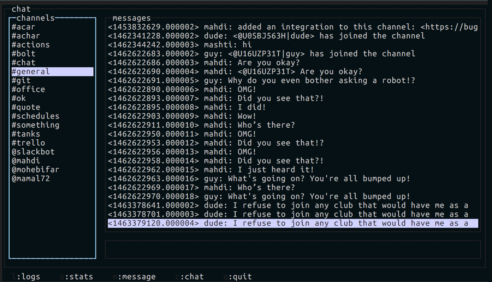

# Dashboard

 You will feel the need to send messages using your bot (He announces his own changes in our team!) and also monitor it's activity and received messages.
 
 The Dude dashboard gives you the ability to chat (send and receive simple messages) and send messages with custom parameters (attachments, etc). You can also read the logs and monitor memory and cpu usage of your bot, along with error/rejection rate.
 
 
 
 The dashboard uses a messaging channel to communicate with your Dude channel. In order to use the dashboard you have to first run your dude process. Let's try it!
 
 ```bash
 npm start;
 ```
 Switch to another tab and do:
 ```bash
 npm run dashboard
 ```