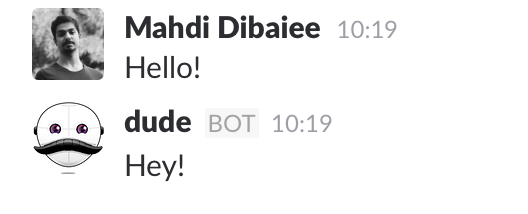

# Getting Started

 Dude uses [`slackbot-api`](https://github.com/mdibaiee/slackbot-api) under the hood, and if you know `slackbot-api`, you already know how to use Dude, it's recommended you read [`slackbot-api`'s documentation](https://mdibaiee.gitbooks.io/slackbot-api/content/) first.
 
## Initializing

 First you have to create a Slack Bot in your Team, to do so navigate to **[Custom Integrations](https://pichak.slack.com/apps/manage/custom-integrations)**, **Bots** and click **Add Configuration**. Enter a name (Dude!), and in the next page you get your **API Token**. You can also choose an image for your bot ([Dude's avatar!](https://raw.githubusercontent.com/dudeee/dude/master/avatar.png)).
 
 Clone Dude, set your **API Token** and run it:
 
 ```bash
 git clone git@github.com:dudeee/dude
 cd dude
 
 npm install
 grunt
 
 cp config-sample.js config.js
 
 export DUDE_SLACK_TOKEN='YOUR_TOKEN'
 npm start
 ``` 
 *By default the API Token is read from ENV (and that's a good practice), see the `config.js` file.*
 
 Ta-daa! Your bot is now alive!
 
 
 
 
 You can either create a plugin or put a file in the `src/tasks` directory to get it running. You can also use `dude` as a module in your other projects.
 
 
 
 In the next chapter, we will discover pocket, schedule and other tools and in the end, we will develop a some plugins.