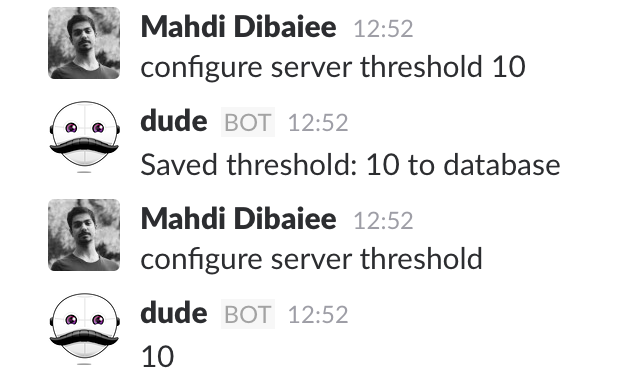

# Pocket

  Pocket is a simple database for your bot, it's not a backpack, it's as simple as a pocket.
  
  Pocket has three methods, `get`, `put` and `del`, all of which return a promise.
  
  Working with Pocket is very simple:
  
  ```javascript
  bot.command('configure server <char> [char]', async message => {
    const [key, value] = message.match;
    
    if (value) {
      await bot.pocket.put(`server.configuration.${key}`, value);
      message.reply(`Saved ${key}: ${value} to database`);
    } else {
      const val = await bot.pocket.get(`server.configuration.${key}`);
      
      message.reply(val);
    }
  });
  ```
  
  
  
 Under the hood, we're using [`levelup`](https://github.com/Level/levelup) with a `leveldown` backend, saved to `database` file inside dude's directory. You can configure `levelup` using `bot.config.database`.